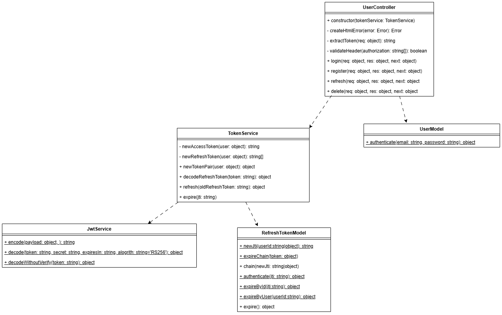

# Auth Server API



## General info

This document describes the available routes on the authentication server. All endpoints are versioned under `/api/v1/`.

### Headers Overview

| Header           | Description                                |
|------------------|--------------------------------------------|
| `Authorization`  |Format: `Bearer <token>` (JWT) |

All requests and responses use `application/json` unless stated otherwise.

### General status codes for all routes

| Code | Description                          |
|------|--------------------------------------|
| 401  | Missing or invalid API key |
| 404  | Not found        |
| 500  | Server error |

---

## POST /refresh

**Description**: Refresh your access token using a valid refresh token.

### Required Headers

- `Authorization: Bearer <refresh-token>`

### Request Body

```json
{}
```

### Response

```json
{
  "accessToken": "<new-access-token>",
  "refreshToken": "<new-refresh-token>"
}
```

### Status Codes

| Code | Description                          |
|------|--------------------------------------|
| 201  | Tokens successfully refreshed        |
| 401  | Missing or invalid refresh token |

---

## POST /register

**Description**: Register a new user account. All fields are required.


### Request Body

```json
{
  "email": "julia@example.com",
  "nickname": "julia_l",
  "birthDate": "1989-02-24",
  "password": "myVerySecretPassword"
}
```

### Response

**Status**: `201 Created`


**Body**:

```json
{
  "message": "Registration successful. Please log in."
}
```

### Status Codes

| Code | Description                          |
|------|--------------------------------------|
| 201  | User registered successfully         |
| 400  | Bad request |
| 401  | Missing or invalid API key           |
| 409  | The nickname or email is already registered |

---

## POST /login

**Description**: Log in. All fields are required.

### Request Body

```json
{
  "username": "julia",
  "password": "myVerySecretPassword"
}
```

### Response

**Status**: `201 Created`


**Body**:

```json
{
  "accessToken": "<new-access-token>",
  "refreshToken": "<new-refresh-token>"
}
```

### Status Codes

| Code | Description                          |
|------|--------------------------------------|
| 201  | User logged in |
| 400  | Bad request |
| 401  | Missing or invalid API key           |
| 409  | The nickname or email is already registered |

---

## DELETE /

**Description**: Deletes a user.

### Required Headers

- `Authorization: Bearer <refresh-token>`


### Request Body

```json
{
  "username": "julia",
  "password": "myVerySecretPassword"
}
```


### Status Codes

| Code | Description                          |
|------|--------------------------------------|
| 204  | The user has been successfully deleted and the refresh token set as expired        |
| 401  | Missing or invalid refresh token, username and token do not match, or wrong password |

---

## Notes

Tokens returned in responses are JWTs signed by the server with assymetric private key.

Access tokens include:
  username
  birthDate

Token rotation and chaining is applied to refresh tokens. If a refresh token is re-used, any active referesh token in the same chain will be inactivated. Each new session has a separate refreshtoken-chain.
